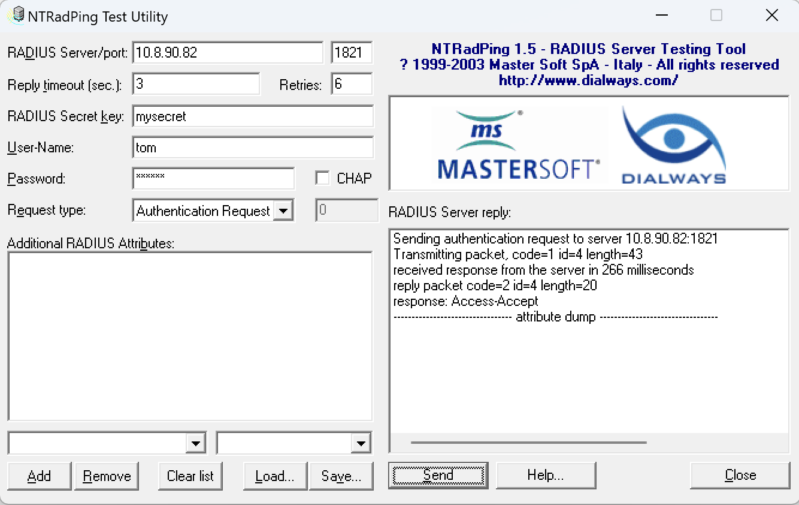

# Radius 服务器

Radius 服务器是一个开源的网络认证服务器，它支持多种认证方式，包括 TACACS+、MS-CHAPv2、EAP-MD5、EAP-TLS、EAP-TTLS、EAP-PEAP、EAP-GTC、EAP-FAST、EAP-IKEv2、EAP-AKA、EAP-SIM 等。

服务基于开源的 [aaa4j-radius](https://github.com/aaa4j/aaa4j-radius) 搭建，本文档将介绍 Radius 服务器的配置、打包、启动等操作。

## 服务端

### 配置

```properties
radius.server.port=1821
radius.server.secret=mysecret

db.url=jdbc:mysql://localhost:3306/radius
db.username=root
db.password=password
```

### 打包

```sh
$ mvn clean package -Dmaven.test.skip=true -U
```

### 启动

```sh
$ java -jar radius-server.jar
```

## 客户端

### 配置

```properties
radius.server.host=192.168.1.1
radius.server.port=1821
radius.server.secret=mysecret
```

### 实现

实例化 RadiusClient

```java
RadiusClient radiusClient = UdpRadiusClient.newBuilder()
                .secret("mysecret".getBytes(UTF_8))
                .address(new InetSocketAddress("localhost", 1821))
                .build();
```

封装 AccessRequest 对象
```java
AccessRequest accessRequest = new AccessRequest(List.of(
                new UserName(new TextData("tom")),
                new UserPassword(new StringData("12345678".getBytes(UTF_8)))
        ));
```

> 这里密码用了 Bcrypt 加密算法，根据实际情况实现自己的 Hash 算法。

认证成功返回 AccessAccept，失败返回 AccessReject。

## 测试

### 用例

* givenCorrectSecret_WhenSendingAccessRequest_ThenAccessAccept
* givenIncorrectPassword_WhenSendingAccessRequest_ThenAccessReject

### NTRadPing 客户端


